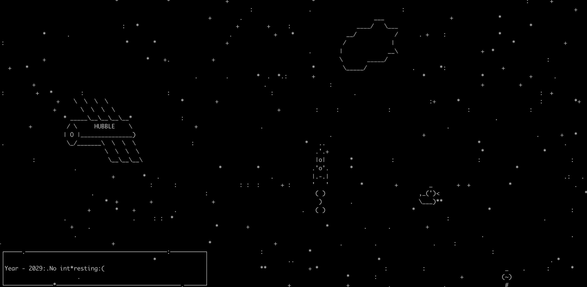

# Through the trash to the stars

Simple console game about space, rocket and space debris problem. Save the orbit from debris!  
Just play and feel old.

> Genre: action, arcade

## How to start?

1. Clone repo: `git clone https://github.com/BlueberryCat0/rocket-game.git`
2. Run game from folder: `python3 main.py`
3. And enjoy...

## How to play?

Arrow control `↑`, `↓`, `←`, `→`.  
Fire on space `␣` (from 2020 year).

## Requirements
Game has been tested with:
* Python: 3.7.1

## Features
* All animations are async
* Custom event loop
* Only standard libraries
* Painting with python curses

